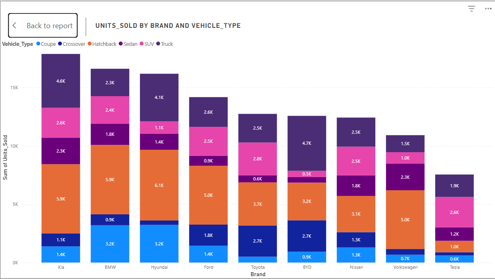

#  Electric Vehicle (EV) Sales Analysis Dashboard | Power BI

I built this Power BI dashboard to explore patterns in electric vehicle (EV) sales using a synthetic dataset from Kaggle. The dataset contains 500 rows of global EV transactions and includes attributes like region, brand, vehicle type, battery capacity, customer segment, fast-charging support, and applied discounts. My goal was not just to visualize trends, but also to understand what’s really driving EV adoption across different customer groups and regions.

---

### Executive Summary

This project tells the story of how EV sales are shaped by more than just price tags or brand names. 

Some key takeaways:

Hatchbacks lead the market in volume, suggesting cost-efficiency and practicality are key drivers for EV buyers.

Fast charging is no longer a luxury feature, even budget-conscious customers are choosing it.

Higher discounts don't always mean higher sales, customers may value features and brand perception more than savings.

North America shows the strongest performance, but Asia and Oceania aren’t far behind, showing a promising global spread.

Overall, the data shows that successful EV strategies depend on understanding what different customer segments prioritize not just offering cheaper options or flashy upgrades.

##  Key Business Questions Answered

1. **Which EV types and brands are most popular?**
2. **Does fast-charging affect revenue or segment preference?**
3. **How do discounts impact purchasing behavior?**
4. **Which customer groups are buying which types of EVs?**
5. **How do sales shift across months and regions?**

---

##  Visualizations & Insights

### 1. Which EV types are selling the most?

> Hatchbacks top the list, with over 39,000 units sold — followed by Trucks (26,600) and SUVs (17,800). Brands like Hyundai and Toyota lead in hatchback and SUV sales. Coupes and sedans have more limited appeal, suggesting niche market interest.

---

### 2. Where are EVs selling the most, and when?  

> North America consistently leads in monthly sales, averaging over 2,700 units from January to May 2023. Asia and Oceania show steady growth, while Europe and South America contribute moderate but stable sales. Peaks in Q2 and Q3 suggest seasonal or promotional effects.

---

### 3. Is fast charging influencing revenue? 

>Yes, and significantly. Vehicles with fast-charging capability brought in $1.61 billion, compared to $1.00 billion without it. That’s a 61% increase, showing clear market preference for faster, more convenient charging options.

---

### 4. Who prefers fast charging?

> Not just tech-savvy or high-income customers. Surprisingly, budget-conscious buyers made over 16,000 fast-charging EV purchases, slightly more than Tech Enthusiasts. This suggests fast charging is becoming an expected standard not just a premium add-on.

---

### 5. Are discounts driving more sales?

> Not really. The highest sales occurred with discounts of just 0–5% (34,900 units). As discounts increased, unit sales dropped — possibly because steep discounts hurt the perceived value of the vehicle. Customers seem to care more about quality and features than just getting a deal.

---
### Conclusion

This wasn’t just about charts, it was about connecting the dots between product strategy and customer behavior. 

### The insights could help:

Marketing teams refine audience targeting based on region and segment preferences

Product managers prioritize features like fast charging across all price ranges

Leadership teams rethink how discounting impacts perception and volume

##  Tools Used
- Power BI Desktop
- DAX
- Custom visuals: Matrix, Decomposition Tree, Scatter Plot
- Synthetic dataset (EV sales)

---

##  Dataset Source
URL: https://www.kaggle.com/datasets/rameezmeerasahib/electric-vehicle-ev-sales-and-adoption?select=train.csv

